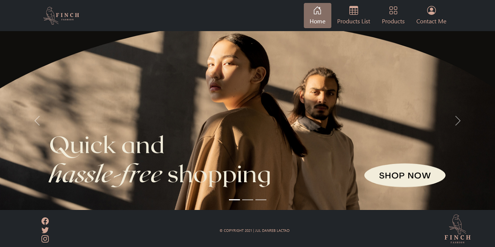

# The Coding School - Shopping Website Project

## Table of contents

- [Overview](#overview)
  - [The challenge](#the-challenge)
  - [Screenshot](#screenshot)
  - [Links](#links)
- [My process](#my-process)
  - [Built with](#built-with)
- [Author](#author)

## Overview

### Assignment

Create a simple shopping website using basic HTML, CSS and Bootstrap for this project.

### Screenshot

### Links

- Live Site URL: [https://julfinch.github.io/Finch-Shopping/](https://julfinch.github.io/Finch-Shopping/)

## My process

### Built with

- Semantic HTML5 markup
- CSS custom properties
- Bootstrap

## Author

- Twitter - [@julfinch](https://www.twitter.com/julfinch)
